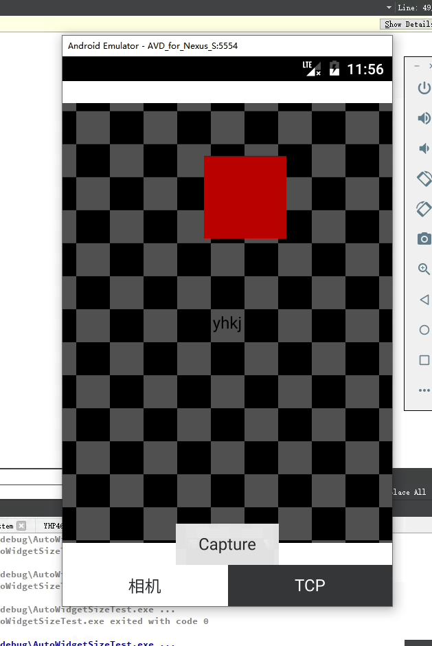

# CPPQMLAndorid

#### 介绍
QML调用安卓相机+QML做UI C++做网络通信显示到相机界面

#### 软件架构
软件架构说明

#### 安装教程

1.  QT 版本5.13.2
2.  模拟器内核 ARM V8
3.  通信方式Tcp
4.  需要安装安卓模拟器 API 版本7.11 +NDK+Java jdk 
环境配置教程https://blog.csdn.net/weixin_38416696/article/details/79483407
#### 使用说明

1.  QT 版本5.13.2
2.  模拟器内核 ARM V8
3.  通信方式Tcp

#### 参与贡献

1.  李牛牛

有最简单的C++和QML的通讯方式包含信号方式和直接调用

